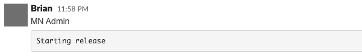
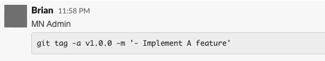

# mikeneder Admin

## Tech Stack 

#### Major stacks

- [x] [Next.js](https://nextjs.org/)
- [x] [Apollo Client](https://www.apollographql.com/docs/react/)

#### Form library

- [x] [Formik](https://github.com/formik/formik)

#### Create custom components

- [x] [styled-components](https://github.com/styled-components/styled-components)
- [x] [Styled System](https://github.com/styled-system/styled-system)
- [x] [Storybook](https://github.com/storybookjs/storybook)'

#### Test

- [x] [Jest](https://github.com/facebook/jest)
- [x] [ts-jest](https://github.com/kulshekhar/ts-jest)
- [x] [React Testing Library](https://github.com/testing-library/react-testing-library)

#### Linter & Formatter

- [x] [ESLint](https://github.com/eslint/eslint)
- [x] [Prettier](https://github.com/prettier/prettier)
- [x] [EditorConfig](https://editorconfig.org/)

#### Pre-commit checks

- [x] [lint-staged](https://github.com/okonet/lint-staged)
- [x] [Husky](https://github.com/typicode/husky)

## Quick start

#### Make sure that you have Node.js and npm installed.

#### Clone this repo using

`git clone --depth=1 <GIT_URL> <YOUR_PROJECT_NAME> && cd <YOUR_PROJECT_NAME> && rm -rf .git`

After cloning this repository, you can add your own git repository use it as the original.

#### Move to the appropriate directory:

`cd <YOUR_PROJECT_NAME>`

Check out a list script below

## Available scripts

#### Install node modules

`npm install` or `yarn`

#### Start development

`npm run dev` or `yarn dev`

### Release Instruction

##### 1.  When creating a new PR, the new build will execute for that PR, then create a new domain for it.

```
http://qa<PR_NUMBER>.admin.mikeneder.me
```
##### 2. Merge your PRs into `master`

- After code reviewed, use `merge` at the bottom of pull request page. The pipeline will run after all checks passed the site will update.
```
http://staging.admin.mikeneder.me
```
##### 3. Confirm your changes on `staging.admin.mikeneder.me`


##### 4. Post starting release in `#web-release` channel


##### 5. Checkout master, pull latest and run

```
$ yarn release -auto
```
This action will run release script automatically which is pull a latest commit and collecting the message then increase previous version to new version.

or we can do it manually

<b>a. Single ticket</b>
```
$ yarn release '- Implement A feature'
```

<b>b. Multiple tickets</b>
```
$ yarn release '
> - Implement A feature'
> - Fix B issue'
> '
```

##### 6. Edit your `Starting release` message in the channel by paste the message that automatically copied to your clipboard after run the command release above.



##### 7. Verify on production
```
https://admin.mikeneder.me
```